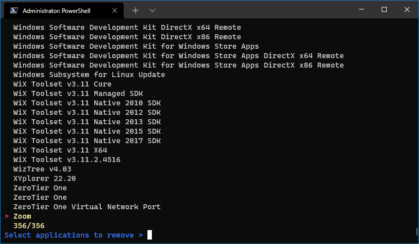
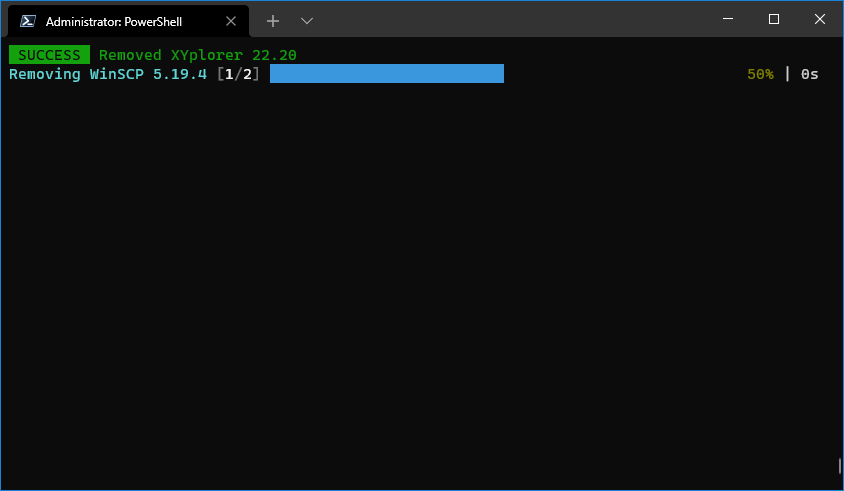

# I Don't Need This

IDNT is a software uninstaller.

## Installation

Download a binary from the [release](https://github.com/r-darwish/idnt/releases) section.

## Usage

Just run the tool, and you'll be presented with a [fzf](https://github.com/junegunn/fzf) like interface. Mark the
applications that you with to remove with `TAB` and then hit `Enter` to remove them all.

## Supported operating systems and application providers

Only Windows at the moment. macOS support will follow soon.
