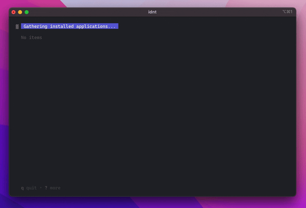

# I Don't Need This

IDNT is a software uninstaller.

## Installation

Download a binary from the [release](https://github.com/r-darwish/idnt/releases) section.

## Usage

Just run the tool, and you'll be presented with a [fzf](https://github.com/junegunn/fzf) like interface. Mark the
applications that you with to remove with `TAB` and then hit `Enter` to remove them all.

Press `w` to go to the application website or `s` to search it in [DuckDuckGo](https://duckduckgo.com).

## Supported operating systems and application providers

macOS, Windows and Linux (APT and Pacman).

macOS users need to install Brew [rmtree](https://github.com/beeftornado/homebrew-rmtree).

### A warning for Linux users

While you probably can't break your system no matter which brew package you uninstall in macOS, it's easy to uninstall
the wrong package in Linux and make your system unbootable. This application does not prompt for any confirmation before
uninstalling the selected packages, so use it with caution.
